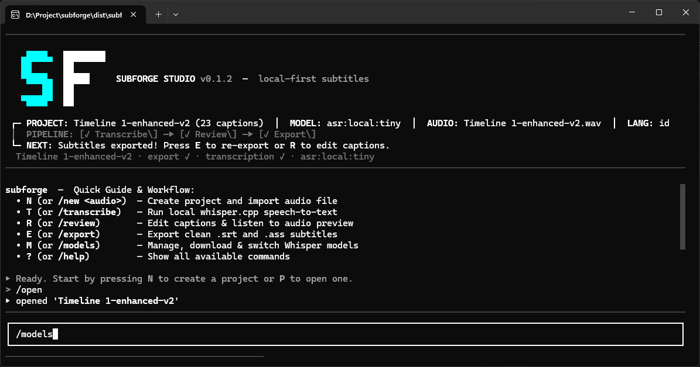

# SubForge

> **Create once. Caption for everyone.**

SubForge is a fast, local-first subtitle generation and editing tool for content creators. Export the final audio from your video editor, and SubForge turns it into accurate, timestamped captions ready for editing and export.

Built accessibility-first: captions that let Deaf and hard-of-hearing viewers follow your content.



## Quick Install (One-Line Installer)

You can install SubForge with a single terminal command — no manual Python, PyTorch, or environment setup required!

### Windows (PowerShell)
```powershell
irm https://raw.githubusercontent.com/yudopr11/subforge/master/install.ps1 | iex
```

### Linux & macOS (Terminal)
```bash
curl -fsSL https://raw.githubusercontent.com/yudopr11/subforge/master/install.sh | sh
```

After installation completes, simply open a new terminal window and type:
```bash
subforge
```

### Uninstallation

To uninstall SubForge:

**Windows (PowerShell):**
```powershell
irm https://raw.githubusercontent.com/yudopr11/subforge/master/uninstall.ps1 | iex
```

**Linux & macOS (Terminal):**
```bash
curl -fsSL https://raw.githubusercontent.com/yudopr11/subforge/master/uninstall.sh | sh
```

---

## How It Works

```
final_audio.wav
      ↓
 Transcribe (local whisper.cpp)
      ↓
 Review Captions (edit text & timing)
      ↓
 Export ({project_name}.srt · {project_name}.ass)
```

## Features

- 🎙️ **Local-First Transcription** — standalone whisper.cpp CLI (GGML models `tiny` … `large-v3`, hardware recommendations based on CPU/RAM, on-demand download in-app with progress bars).
- ✍️ **Caption Review & Audio Playback** — view, edit, audio preview (`p` to play, `x` to stop), and undo/redo (`Ctrl+Z`/`Ctrl+Y`) caption text in a terminal UI.
- 📦 **Direct Export** — export clean SRT & ASS files directly to your current working directory and project archives.
- ⚡ **Zero Bloat** — lightweight (<50 MB) without heavy PyTorch or CUDA dependencies.
- 🖥️ **Monochrome & Transparent Aesthetic** — clean terminal design with transparent background support.

---

## Quick Start (Commands)

Launch SubForge in your terminal:
```bash
subforge
```

Then work with simple slash commands or keyboard shortcuts:

- `/new <audio>` (or press **`N`**) — Create project & import audio file.
- `/transcribe` (or press **`T`**) — Transcribe audio using local whisper.cpp.
- `/review` (or press **`R`**) — Open caption review, edit text, and preview audio.
- `/export` (or press **`E`**) — Export `.srt` and `.ass` to current working directory.
- `/models` (or press **`M`**) — Install & manage local Whisper GGML models.
- `/language` — Set default audio source language (or auto-detect).
- `/wizard` — Re-run the guided first-run setup wizard.
- `/status` — View pipeline stage states.
- `?` or `/help` — View all commands.

---

## Developer Setup

For developers contributing or building from source:

```bash
git clone https://github.com/yudopr11/subforge.git
cd subforge
uv sync
uv run pytest
uv run subforge
```
